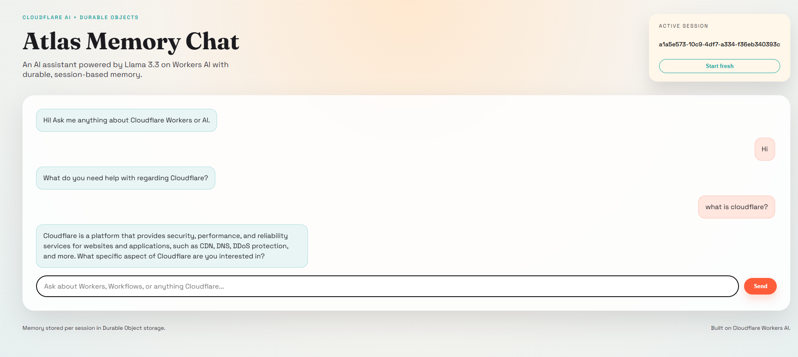

# Atlas Memory Chat (Cloudflare AI)

Atlas Memory Chat is an AI-powered chat app built on Cloudflare Workers AI with Durable Object memory. It uses the Llama 3.3 model on Workers AI, stores conversation state per session, and serves a stylized chat UI from Workers assets.

## Live demo
- https://cf_ai_atlas_memory_chat.jatin-salve.workers.dev

## Screenshot


Replace `docs/screenshot.svg` with a real screenshot of your deployed UI.

## What it demonstrates
- **LLM**: Llama 3.3 on Workers AI
- **Workflow / coordination**: The Worker orchestrates the AI call and persists state in a Durable Object
- **User input**: Web chat UI served from Workers assets
- **Memory / state**: Durable Object storage retains per-session conversation history

## Architecture (request flow)
1. Browser sends a message to `/api/chat`.
2. Worker loads prior messages from the Durable Object.
3. Worker calls Workers AI with the system prompt + session history.
4. Worker writes the updated history back to the Durable Object.
5. UI renders the assistant response.

## Project structure
- `src/worker.ts` - Worker routes + Durable Object logic
- `public/` - static UI assets
- `wrangler.toml` - Workers config and bindings
- `PROMPTS.md` - AI prompts used during development

## Prerequisites
- Node.js 18+
- A Cloudflare account with Workers AI enabled
- Wrangler CLI (`npm i -g wrangler`) or use the local dev dependency

## Run locally
1. Install dependencies:
   ```bash
   npm install
   ```
2. Authenticate Wrangler:
   ```bash
   npx wrangler login
   ```
3. Start the dev server (AI binding runs remotely):
   ```bash
   npx wrangler dev
   ```
4. Open the URL Wrangler prints and start chatting.

Note: If local dev fails due to the remote AI binding proxy, use the deployed URL instead.

## Deploy
```bash
npx wrangler deploy
```

## Assignment requirements
- Repository name must start with `cf_ai_`
- Include `README.md` with clear run instructions (this file)
- Include `PROMPTS.md` with AI prompts used

## Credits
Built for the Cloudflare AI application assignment.
